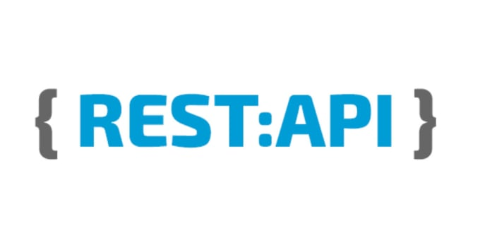
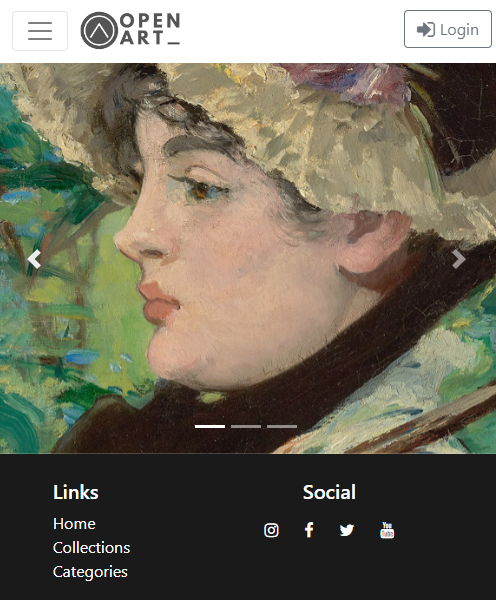
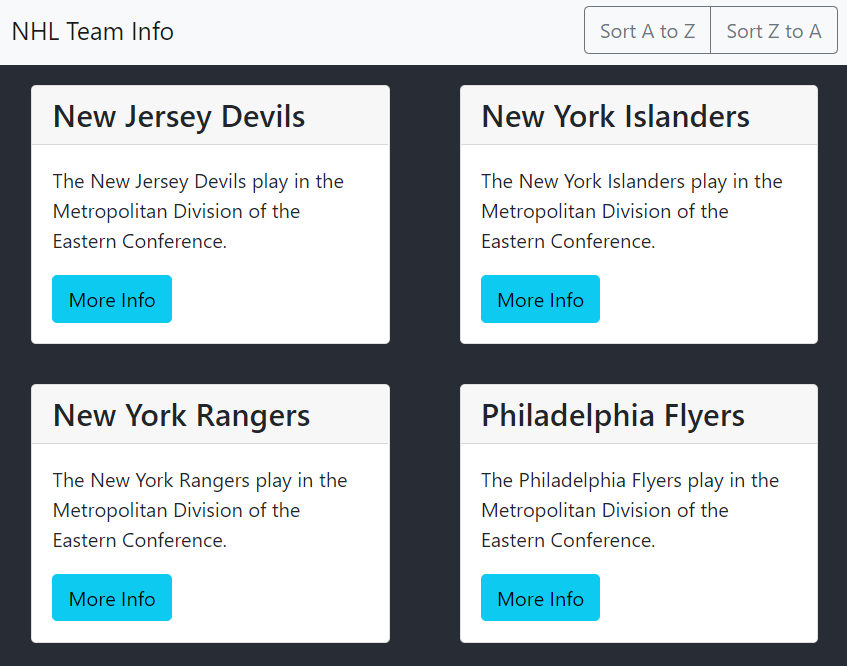

   

<h2  style="margin-top:12px" align= "center">
    Technologies
</h2>
<table align= "center">
    <tr>
        <td align="center"  width="140" height="112.43">
            
             JavaScript ES6
        </td>
        <td align="center"  width="140" height="112.43">
            
             React.js
        </td>
        <td align="center"  width="140" height="112.43">
            
             React Native
        </td>
    </tr>
    <tr>
        <td align="center"  width="140" height="112.43">
            
             Redux
        </td>
        <td align="center"  width="140" height="112.43">
            
             CSS3
        </td>
        <td align="center"  width="140" height="112.43">
            
             Bootstrap
        </td>
    </tr>
    <tr>
        <td align="center"  width="140" height="112.43">
            
             Node.js
        </td>
        <td align="center"  width="140" height="112.43">
            
             Express
        </td>
        <td align="center"  width="140" height="112.43">
            
             RESTful API
        </td>
    </tr>
</table>

 
 
 

<h2 align="center">Repositories</h2>

    
     
     

    
This website searches The Art Institute of Chicago's database. View the README file for details.

    <a
        align="center" 
        href="https://open-art.netlify.app/" 
        title="Open Art: Front End"
        target="_blank" rel="noopener noreferrer"
        >Live Site
    </a>
         
         
    <a
        align="center" 
        href="https://github.com/Grismund/openart-front-react" 
        title="Open Art: Front End"
        target="_blank" rel="noopener noreferrer"
        >Front End Code
    </a>
         
         
    <a
        align="center" 
        href="https://github.com/Grismund/openart-back-node" 
        title="Open Art: Front End"
        target="_blank" rel="noopener noreferrer"
        >Back End Code
    </a>

     
     
     

    
     
     

    
This website gathers data from two RESTful API endpoints and creates a sortable list of NHL teams, some info, their stats, and links to their websites.

    <a
        align="center" 
        href="https://nhl-team-info.netlify.app/" 
        title="NHL Team Info: Live Site"
        target="_blank" rel="noopener noreferrer"
        >Live Site
    </a>
         
         
    <a
        align="center" 
        href="https://github.com/Grismund/NHL-Team-Data" 
        title="NHL Team Info: Front End Code"
        target="_blank" rel="noopener noreferrer"
        >Front End Code
    </a>
         
         

<h3 align="center" marginTop="40px">
    <a href="https://github.com/Grismund?tab=repositories" title="Show Repositories" target="_blank" rel="noopener noreferrer">Show More</a>
</h3>

 
 
 

<h2  style="margin-top:12px" align= "center">
    Contact
</h2>

<table align= "center">
    <td align="center"  width="240" height="112.43">
         
        <a href="https://www.linkedin.com/in/seth-faerber/" target="_blank" rel="noopener noreferrer">
         
         
        
    </td>
</table>

